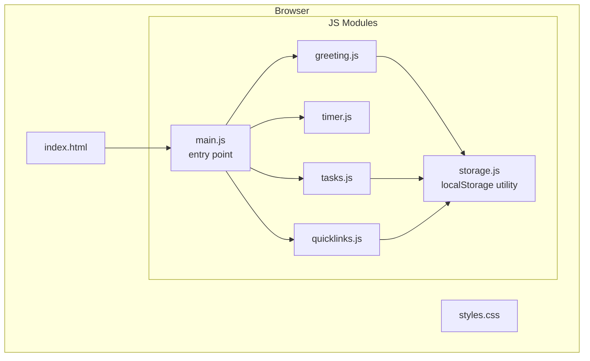
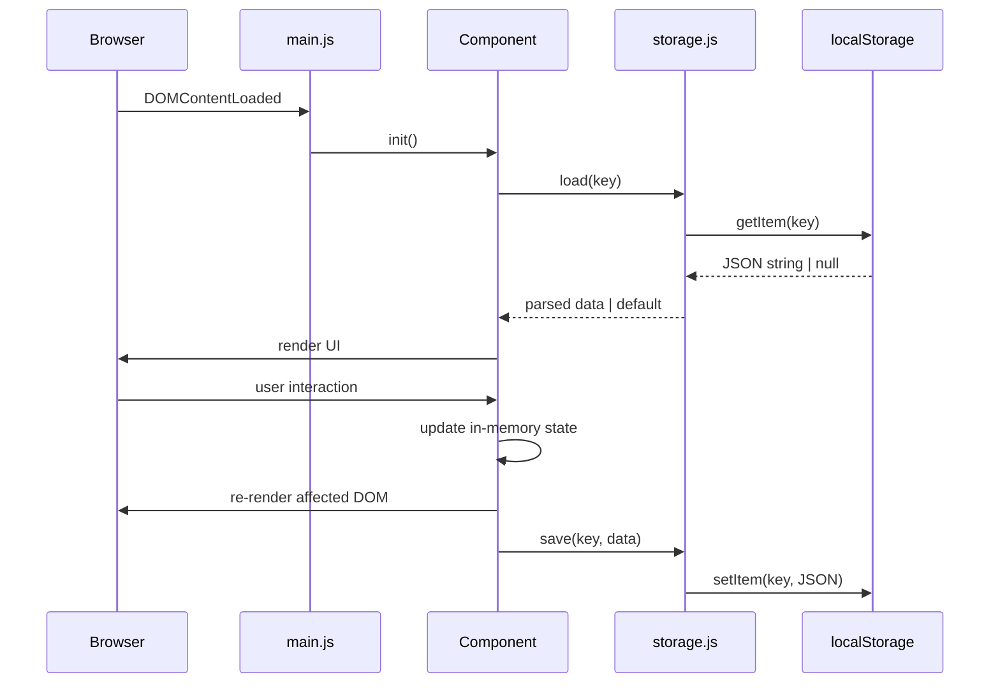
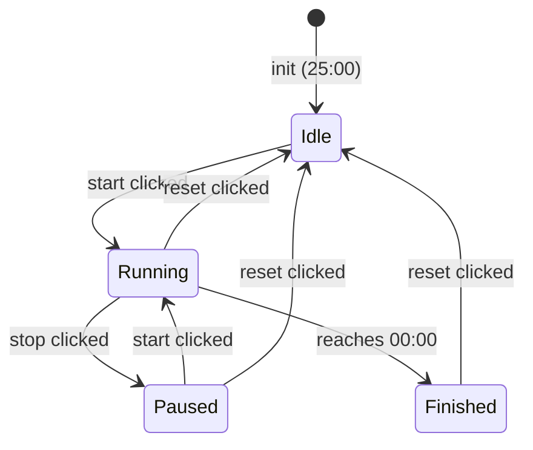

# Design Document: To-Do Life Dashboard

## Overview

The To-Do Life Dashboard is a single-page, client-side web application built with vanilla HTML, CSS, and JavaScript. It requires no build toolchain, no backend server, and no external dependencies beyond the browser itself. All user data is persisted in `localStorage` under namespaced keys.

The application renders four independent components on a single page:

1. **Greeting Component** — displays the current time, date, and a time-based greeting that updates every second.
2. **Focus Timer** — a Pomodoro-style 25-minute countdown timer with start, stop, and reset controls.
3. **Task List** — a CRUD interface for personal tasks with completion tracking and persistence.
4. **Quick Links** — a configurable set of shortcut buttons (up to 20) that open URLs in new tabs.

### Design Decisions

- **Vanilla JS only**: Avoids framework dependency, keeping the app a static file deployable anywhere. Matches the stated constraint of no backend.
- **Module pattern (ES Modules or IIFE)**: Keeps component logic isolated without a bundler. Each component is a self-contained module.
- **localStorage as the only persistence layer**: Aligns with the requirement of no network dependency. Operations target namespaced keys to avoid collisions.
- **No external libraries**: Maximises cross-browser compatibility and removes supply-chain risk.

---

## Architecture

The application follows a component-based architecture within a single HTML file. JavaScript logic is split into ES Modules (one per component plus a shared storage utility). CSS uses a flat class naming convention.



### Data Flow

All components read their initial state from `storage.js` on page load and write back on every mutation. Components never communicate with each other — they are fully independent.



---

## Components and Interfaces

### 1. Greeting Component (`greeting.js`)

**Responsibility**: Display current time, date, and greeting. Update every second via `setInterval`.

**Public interface**:
```js
// Mounts the greeting component into the given container element
function initGreeting(containerEl: HTMLElement): void
```

**Greeting rules** (pure function, independently testable):
```js
// Returns the greeting string for a given hour (0-23)
function getGreeting(hour: number): string
// 5–11  → "Good Morning"
// 12–16 → "Good Afternoon"
// 17–20 → "Good Evening"
// 21–23, 0–4 → "Good Night"
```

**Time formatting** (pure function):
```js
// Returns "hh:mm:ss AM/PM"
function formatTime(date: Date): string

// Returns "Weekday, Month DD, YYYY"
function formatDate(date: Date): string
```

**Tick mechanism**: A single `setInterval` at 1000 ms calls `render()`, which writes to the DOM. On init, `render()` is called immediately to avoid a 1-second blank.

---

### 2. Focus Timer (`timer.js`)

**Responsibility**: 25-minute countdown with start/stop/reset. Manages button enable/disable states.

**State machine**:


**Public interface**:
```js
function initTimer(containerEl: HTMLElement): void
```

**Internal state**:
```js
{
  totalSeconds: number,   // remaining seconds, init 1500
  intervalId: number | null,
  status: 'idle' | 'running' | 'paused' | 'finished'
}
```

**Pure helpers**:
```js
// Converts seconds to "MM:SS"
function formatCountdown(seconds: number): string

// Returns button enable/disable map for a given status
function getControlState(status: TimerStatus): ControlState
```

Timer state is **not** persisted to localStorage (a reloaded page always shows a fresh 25:00, consistent with Req 4.1).

---

### 3. Task List (`tasks.js`)

**Responsibility**: CRUD operations on tasks. Syncs to localStorage after every mutation.

**Public interface**:
```js
function initTasks(containerEl: HTMLElement): void
```

**In-memory state**:
```js
Task[] // array held in module closure
```

**Operations**:
```js
function createTask(description: string): Result<Task, ValidationError>
function editTask(id: string, description: string): Result<Task, ValidationError>
function toggleTask(id: string): Result<Task, NotFoundError>
function deleteTask(id: string): Result<void, NotFoundError>
function loadTasks(): Task[]      // reads + parses localStorage
function saveTasks(tasks: Task[]): SaveResult
```

**Validation rules** (pure, testable):
```js
function validateDescription(text: string): ValidationResult
// Invalid if: trimmed length === 0 (whitespace-only), or length > 500
```

---

### 4. Quick Links (`quicklinks.js`)

**Responsibility**: Create, display, and delete Quick Link buttons. Open URLs in new tabs.

**Public interface**:
```js
function initQuickLinks(containerEl: HTMLElement): void
```

**Operations**:
```js
function createLink(name: string, url: string): Result<QuickLink, ValidationError>
function deleteLink(id: string): Result<void, NotFoundError>
function loadLinks(): QuickLink[]
function saveLinks(links: QuickLink[]): SaveResult
function openLink(url: string): void  // window.open(url, '_blank')
```

**Validation rules** (pure, testable):
```js
function validateLink(name: string, url: string): ValidationResult
// name: 1-50 characters (trimmed)
// url:  1-2048 characters, must start with http:// or https://
// count: max 20 links
```

---

### 5. Storage Utility (`storage.js`)

Thin wrapper over `localStorage` providing JSON serialisation, error handling, and namespaced keys.

```js
const KEYS = {
  TASKS:  'todo_dashboard_tasks',
  LINKS:  'todo_dashboard_links',
}

function load<T>(key: string, fallback: T): T
// Catches JSON.parse errors → returns fallback

function save(key: string, value: unknown): SaveResult
// Catches QuotaExceededError and other DOMExceptions
// Returns { ok: true } | { ok: false, error: string }
```

---

## Data Models

### Task

```ts
interface Task {
  id: string;           // crypto.randomUUID() or Date.now() fallback
  description: string;  // 1-500 chars
  completed: boolean;   // false on creation
  createdAt: number;    // Unix timestamp (ms)
}
```

Stored as JSON array under key `todo_dashboard_tasks`.

### QuickLink

```ts
interface QuickLink {
  id: string;           // crypto.randomUUID() or Date.now() fallback
  name: string;         // 1-50 chars
  url: string;          // 1-2048 chars, http(s) only
  createdAt: number;    // Unix timestamp (ms)
}
```

Stored as JSON array under key `todo_dashboard_links`.

### Timer State (in-memory only, not persisted)

```ts
interface TimerState {
  totalSeconds: number;   // 0-1500
  status: 'idle' | 'running' | 'paused' | 'finished';
  intervalId: number | null;
}
```

### localStorage Schema

```
todo_dashboard_tasks  →  Task[]   (JSON)
todo_dashboard_links  →  QuickLink[]  (JSON)
```

On load, if the stored value is absent, `null`, or unparseable JSON, the component initialises with an empty array and (for corrupted data) shows a warning toast.

---

## Correctness Properties

*A property is a characteristic or behavior that should hold true across all valid executions of a system — essentially, a formal statement about what the system should do. Properties serve as the bridge between human-readable specifications and machine-verifiable correctness guarantees.*

### Property 1: Greeting is exhaustive and deterministic

*For any* integer hour in [0, 23], `getGreeting(hour)` always returns exactly one of "Good Morning", "Good Afternoon", "Good Evening", or "Good Night" — every possible hour has a defined greeting, and calling the function twice with the same hour always produces the same result.

**Validates: Requirements 2.1, 2.2, 2.3, 2.4**

---

### Property 2: Task description validation is correct at all boundaries

*For any* string composed entirely of whitespace characters, `validateDescription` returns an invalid result. *For any* string whose length exceeds 500 characters, `validateDescription` returns an invalid result. *For any* string of length in [1, 500] that contains at least one non-whitespace character, `validateDescription` returns a valid result.

**Validates: Requirements 5.1, 5.2, 6.2, 6.3**

---

### Property 3: Task persistence round-trip

*For any* sequence of task operations (create, edit, toggle, delete) applied to a task list, serialising that list to localStorage and then deserialising it produces a list with the same tasks — identical ids, descriptions, and completion statuses — in the same order.

**Validates: Requirements 5.3, 5.4, 5.5, 9.1, 9.3**

---

### Property 4: Task toggle is an involution

*For any* existing task, toggling its completion status twice returns the task to its original completion state.

**Validates: Requirements 7.1**

---

### Property 5: Task deletion is complete

*For any* task list containing a task with id X, deleting X produces a list that contains no task with id X, and all other tasks remain in the list unchanged.

**Validates: Requirements 8.1, 8.2**

---

### Property 6: Quick Link field validation is correct at all boundaries

*For any* URL string that does not begin with `http://` or `https://`, `validateLink` returns an invalid result. *For any* name string whose trimmed length is 0 or greater than 50, `validateLink` returns an invalid result. *For any* name of trimmed length in [1, 50] paired with a URL that begins with `http://` or `https://` and has length ≤ 2048, `validateLink` returns a valid result.

**Validates: Requirements 10.1, 10.3, 10.4**

---

### Property 7: Quick Link count cap is enforced

*For any* Quick Link list already containing 20 entries, any attempt to create a new Quick Link returns an error and the list size remains exactly 20.

**Validates: Requirements 10.5**

---

### Property 8: Quick Link persistence round-trip

*For any* set of Quick Links, serialising that set to localStorage and then deserialising it produces the same set of Quick Links with identical ids, names, and URLs.

**Validates: Requirements 12.1, 12.3**

---

### Property 9: Countdown format is always valid MM:SS

*For any* integer seconds value in [0, 1500], `formatCountdown(seconds)` returns a string of the form "MM:SS" where MM is a zero-padded two-digit minute count, SS is a zero-padded two-digit seconds count, and `MM * 60 + SS === seconds`.

**Validates: Requirements 3.2**

---

### Property 10: Timer control state is pure and deterministic

*For any* timer status value in `{'idle', 'running', 'paused', 'finished'}`, `getControlState(status)` always returns the same button enable/disable map — calling it multiple times with the same status never produces a different result.

**Validates: Requirements 4.1, 4.5, 4.6**

---

## Error Handling

### localStorage Unavailability

`storage.save()` wraps `localStorage.setItem` in a try/catch. A `QuotaExceededError` or any other `DOMException` returns `{ ok: false, error: string }`. The calling component:
- Keeps the mutation in the in-memory state (the user's action is not rolled back).
- Displays a dismissible toast/banner warning that data will not persist across sessions.

`storage.load()` wraps `JSON.parse` in a try/catch. A parse error returns the provided fallback value, and the component displays a warning toast that corrupted data was discarded.

### Validation Errors

All validation errors are surfaced inline, adjacent to the relevant input field, as red descriptive text. They are announced via `aria-live` regions for screen reader accessibility. Errors clear when the user begins typing again or successfully submits.

### Quick Link Click with Invalid URL

If a saved Quick Link somehow has an empty or invalid URL at click time, `window.open` is not called. An error message is displayed instead (Req 11.3).

### Timer Edge Cases

- Resetting a running timer: the `intervalId` is cleared before resetting state to prevent a ghost tick.
- Rapid clicking start/stop: state machine guards prevent re-entering a transition that is already in progress.

---

## Testing Strategy

### Unit Tests (Example-Based)

Test runner: **Vitest** (or plain `<script type="module">` in a test HTML if no build step is desired; Vitest is preferred for its native ES Module support and zero-config setup).

Focused on pure functions that encode business rules:

| Unit Under Test | Test Cases |
|---|---|
| `getGreeting(hour)` | All four boundary hours (5, 12, 17, 21) and their neighbours |
| `formatTime(date)` | Midnight, noon, 11:59 PM — checks 12-hour format and AM/PM |
| `formatDate(date)` | Known date → expected string |
| `formatCountdown(seconds)` | 0 → "00:00", 1500 → "25:00", 65 → "01:05" |
| `validateDescription(text)` | Empty, whitespace-only, 1 char, 500 chars, 501 chars |
| `validateLink(name, url)` | Invalid protocol, no protocol, empty name, 51-char name, count = 20 |
| `getControlState(status)` | All four status values |
| `storage.load` | Missing key → fallback, malformed JSON → fallback |
| `storage.save` | Normal write, simulated QuotaExceededError |

### Property-Based Tests

Property-based testing library: **[fast-check](https://github.com/dubzzz/fast-check)** (JavaScript; widely maintained, zero-config with Vitest).

Each test runs a **minimum of 100 iterations** via fast-check's default runner.

Each test is tagged with a comment:
```
// Feature: to-do-life-dashboard, Property N: <property text>
```

| Property | Test Description |
|---|---|
| Property 1 | `fc.integer({ min: 0, max: 23 })` → `getGreeting` always returns one of four known strings; same input always gives same output |
| Property 2 | `fc.string` (whitespace-only) → `validateDescription` invalid; `fc.string({ minLength: 501 })` → invalid; `fc.string` filtered [1,500] with non-ws → valid |
| Property 3 | Arbitrary mutation sequence (create/edit/toggle/delete) → save → load → deep-equal (id, description, completed, order) |
| Property 4 | Any task → toggle twice → `completed` equals original value |
| Property 5 | Any task list + existing id → delete → id absent from result; all other tasks intact |
| Property 6 | `fc.string` not starting with http(s) → `validateLink` invalid; trimmed name length 0 or >50 → invalid; valid name + valid URL → valid |
| Property 7 | List of 20 links + any add attempt → error returned, list length stays exactly 20 |
| Property 8 | Arbitrary QuickLink array → save → load → deep-equal (id, name, url) |
| Property 9 | `fc.integer({ min: 0, max: 1500 })` → `formatCountdown` returns "MM:SS" and `MM*60+SS === input` |
| Property 10 | Any valid timer status string → `getControlState` returns same map on repeated calls (pure/deterministic) |

### Integration Tests

Run against a real browser environment (using `jsdom` with Vitest or Playwright for end-to-end):

- Dashboard loads and all four sections render without JS errors (Req 13.1).
- A full task lifecycle: create → edit → complete → delete, verifying localStorage state after each step (Req 9.3).
- A full Quick Link lifecycle: create → click → delete (Req 10–12).
- Timer: start → run 2 seconds → stop → verify remaining time decreased correctly.
- localStorage unavailable simulation: wrap `localStorage.setItem` to throw and verify warning is shown.

### Accessibility

- All interactive elements have accessible labels (button text or `aria-label`).
- Error messages are in `aria-live="polite"` regions.
- Focus management: after adding a task or link, focus returns to the input field.

### Browser Compatibility Checks

Manual smoke test across Chrome 90+, Firefox 88+, Edge 90+, Safari 14+ per Req 13.1. Automated cross-browser coverage via Playwright if CI is configured.
